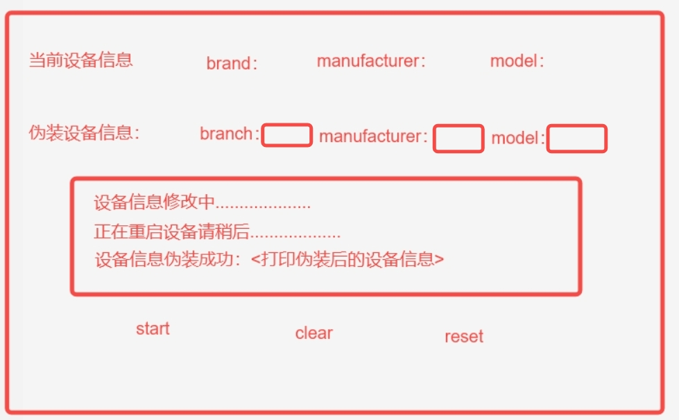
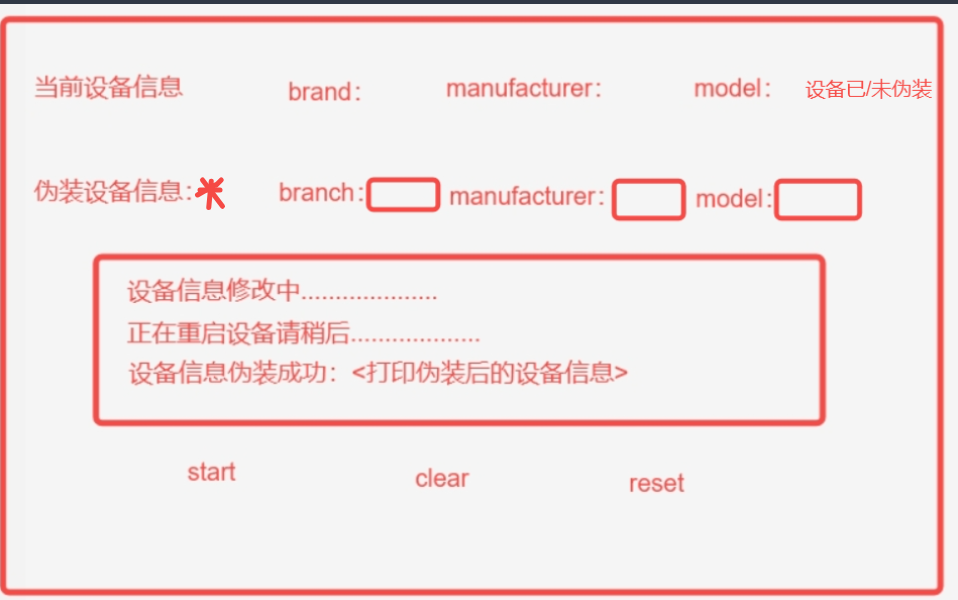
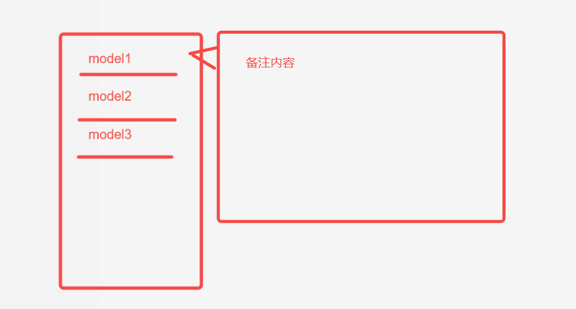
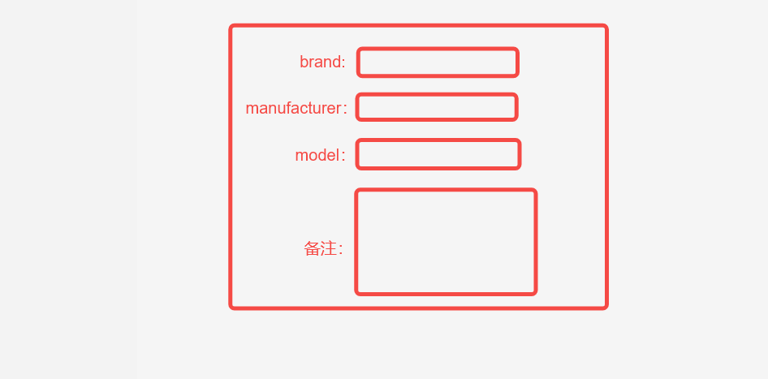

# 工具名称

**Toolkit**（窗口标题）。界面通过选项卡分为两部分：
- **ModifyModelNameTool**：设备型号伪装与重置（本说明对应此功能）
- **push policy**：策略配置文件推送（详见 `spec-push-policy.md`）

## 目录

- [功能（ModifyModelNameTool 选项卡）](#功能modifymodelnametool-选项卡)
- [界面示意图文件](#界面示意图文件)
- [Git 与提交（协作者）](#git-与提交协作者)

# 功能（ModifyModelNameTool 选项卡）

1，界面总览（线框图）：

主界面效果参考：

* 第一行内容说明：当前设备信息这栏信息需要在Android设备连接PC时，自动打印出来
* 第二行内容说明：伪装设备信息，红框内需要用户手动填写
  * 此栏支持记忆用户历史输入的功能，下拉箭头选择对应的数据；
  * 选取三项中其中一项需要自动带出其他两项填入，如果有多个按照首字母顺序排序自动填入第一个。
  * "伪装设备信息："后的图案为按钮，点击后选取数据库内的保存的设备信息，然后自动填充带入红框内
    * 点击按钮后，弹窗长宽固定，弹出位置在按钮右下角，示例： 
    * 鼠标指示到model，停留1S，自动弹出备注内容
* 第四行内容说明：
  * 点击start后，校验数据库中当前组合是否存在，如果不存在，弹出对话框要求用户保存当前伪装设备信息，对话框格式如图UI2.jpg  ；如果已经存在，执行伪装设备信息的功能
    * 备注中需要置灰显示内容：请描述此设备信息对应哪些高帧游戏
    * 需要有save以及cancel按钮用于保存信息
  * 点击clear后，清除第二行的内容
  * 点击reset后，将设备还原为伪装前的信息
* 第三行内容说明：显示当前的任务进度
  * 点击start后，需要根据任务执行的进度按照图中信息进行打印
  * 点击reset后，同样打印任务执行进度，最后一行打印修改为"设备信息重置成功",打印出重置后的设备信息

## 界面示意图文件

本目录下与说明对应的静态资源（**纳入 Git**，协作者 `git pull` 后应与文档一并存在）：

| 文件 | 说明 |
|------|------|
| `UI.jpg` | 整体线框 / 布局示意 |
| `ui.png` | 主界面参考 |
| `ui2.png` | 保存对话框示意 |
| `ui3.png` | 设备选取弹窗示意 |

## Git 与提交（协作者）

- 拉取远程后请阅读仓库根目录 [README.md](README.md) 与 [.github/COMMIT_MSG_TEMPLATE.md](.github/COMMIT_MSG_TEMPLATE.md)。
- 在仓库根目录执行一次：`git config commit.template .github/COMMIT_MSG_TEMPLATE.md`。
- `.gitignore` 会排除编译产物、虚拟环境、本地备份与个人 `config.json`；**不要**把模板文件或 `.gitignore` 加入忽略列表。
- 提交前用 `git status` 确认仅包含有意义的源码与文档。
